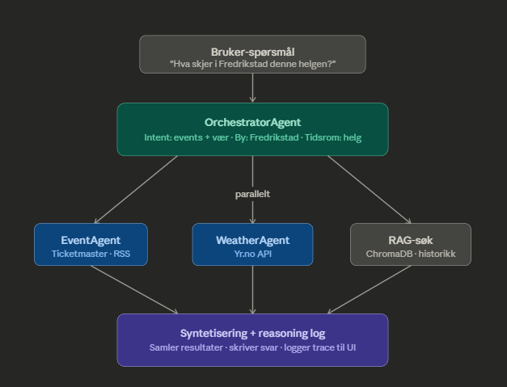

# CityPulse — Multi-Agent City Intelligence Platform

**Multi-agent AI platform delivering real-time intelligence about Norwegian cities**

An orchestrator agent interprets natural language queries, delegates to specialized sub-agents fetching live data from multiple APIs, and synthesizes results using Claude AI with web search fallback.



---

## 🏗️ Tech Stack

### Backend
- **Framework:** FastAPI (Python 3.11)
- **AI:** Anthropic Claude Sonnet with web search tool
- **Agent pattern:** Async orchestrator + 4 specialized sub-agents
- **HTTP client:** HTTPX (async)
- **Geocoding:** Nominatim (OpenStreetMap)

### Frontend
- **Framework:** Next.js 14 (App Router)
- **Styling:** TailwindCSS
- **TypeScript:** Full type safety
- **Maps:** Leaflet with CartoDB dark tiles
- **HTTP Client:** Axios

### Data Sources
- **Yr.no** — Real-time weather for all Norwegian cities
- **Ticketmaster Discovery API** — Upcoming events
- **NRK RSS** — Local news by region
- **SSB API** — Historical housing price index (Statistics Norway)

---

## 🤖 Agent Architecture
```
User Query
    │
    ▼
OrchestratorAgent
├── Interprets intent (weather / events / news / property)
├── Selects relevant agents
├── Runs agents in parallel (asyncio.gather)
└── Synthesizes with Claude Sonnet + web search fallback
    │
    ├── WeatherAgent   → Yr.no locationforecast API
    ├── EventAgent     → Ticketmaster Discovery API
    ├── NewsAgent      → NRK RSS feeds by region
    └── PropertyAgent  → SSB Statistics API (table 07230)
```

**Security:** Input sanitization with prompt injection detection on all user queries. Pattern matching against known injection attempts, input length validation, and Claude system prompt hardening.

**Model selection:** Claude Sonnet is used when Ticketmaster returns no events (triggers web search). Claude Haiku is used when local event data is available, reducing API costs.

---

## 🚀 Local Development

### Prerequisites
- Python 3.11+
- Node.js 20+
- Anthropic API key
- Ticketmaster API key (free at developer.ticketmaster.com)

### 1. Clone & Setup
```bash
git clone https://github.com/JorgenFje/citypulse.git
cd citypulse
```

### 2. Backend Setup
```bash
cd backend

python -m venv venv
venv\Scripts\activate  # Windows
# source venv/bin/activate  # Mac/Linux

pip install -r requirements.txt
```

**Create `backend/.env`:**
```
ANTHROPIC_API_KEY=your_anthropic_api_key
TICKETMASTER_API_KEY=your_ticketmaster_consumer_key
```

**Run backend:**
```bash
uvicorn main:app --reload
```

Backend runs at: http://localhost:8000

### 3. Frontend Setup
```bash
cd frontend

npm install
npm run dev
```

Frontend runs at: http://localhost:3000

---

## 🗺️ Features

- **Interactive Norway map** — Click any major city or search for any Norwegian town via Nominatim geocoding
- **Live agent reasoning feed** — Watch agents activate and work in real time with animated trace
- **Natural language queries** — Ask anything about a city in Norwegian
- **Web search fallback** — Claude searches the web when local agents lack data
- **Smart model selection** — Haiku for simple queries, Sonnet when web search is needed
- **Prompt injection protection** — Input sanitization on all user queries
- **All Norwegian cities supported** — Geocoding via Nominatim for any location
- **Quick actions** — One-click overview, weather, events, news and property queries

---

## 🔐 Security

- Prompt injection filter on all user input
- Input length validation (max 300 chars)
- Pattern matching against known injection attempts
- Claude system prompt hardening against role override

---

## 📁 Project Structure
```
citypulse/
├── backend/
│   ├── agents/
│   │   ├── orchestrator.py   # Intent parsing, parallel execution, Claude synthesis
│   │   ├── weather.py        # Yr.no API + Nominatim geocoding
│   │   ├── events.py         # Ticketmaster Discovery API
│   │   ├── news.py           # NRK RSS by region
│   │   └── property.py       # SSB Statistics API
│   ├── main.py               # FastAPI app + CORS
│   └── requirements.txt
├── frontend/
│   └── app/
│       ├── page.tsx           # Main UI
│       └── MapComponent.tsx   # Leaflet map with city search
└── Image-Architecture.png
```

---

## 📝 Developed by

**[Fjellstad Teknologi](https://fjellstadteknologi.no)**

Built to demonstrate:
- Multi-agent AI architecture with orchestrator pattern
- Async parallel data fetching with asyncio
- LLM integration with tool use (web search)
- Prompt engineering and LLM security
- Full-stack TypeScript/Python development
- Interactive mapping with Leaflet
- Production-ready FastAPI + Next.js
